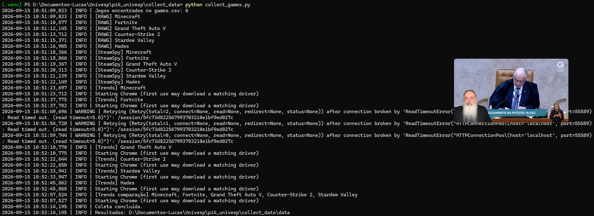

# Game Data Collection

Script para obter dados para o Projeto Integrador IV, utilizando:

- Google Trends
- RAWG API (https://rawg.io/apidocs)
- SteamSpy
- Python + Pandas



## 1. Criar ambiente

### Windows PowerShell

```powershell
py -3 -m venv .venv
.\.venv\Scripts\Activate.ps1
python -m pip install --upgrade pip
pip install -r requirements.txt
```

## 2. Configurar a chave

Copie:

```powershell
copy .env.example .env
```

Abra `.env` e coloque:

```env
RAWG_API_KEY=SUA_CHAVE
```

Acesse https://rawg.io/apidocs e crie sua RAWG_API_KEY

OBS: Não coloque `.env` no Git. Ele já está no `.gitignore`.

## 3. Cadastrar jogos

Edite `games.csv`:

```csv
game,genre,steam_appid
Minecraft,Sandbox,
GTA V,Action,271590
Counter-Strike 2,FPS,730
```

O `steam_appid` é necessário apenas para obter dados do SteamSpy.

## 4. Executar

```powershell
python collect_games.py
```

Ou:

```powershell
python collect_games.py --geo BR --timeframe "today 5-y"
```

## 5. Resultados

O programa cria uma análise prévia dos dados:

```text
data/
├── games_metadata.csv
├── steamspy.csv
├── google_trends.csv
├── google_trends_comparable.csv
├── analysis_summary.csv
├── collection_config.json
└── raw/
```

Onde a pasta `raw/` contém os dados brutos baixados

### Segurança

Nunca publique a chave RAWG ou da STEAM no GitHub.

A chave fica somente em:

```text
.env
```

e o `.gitignore` impede que ela seja versionada.

### Google Trends

O coletor usa `trendspyg`. Ele não utiliza uma chave de API do Google neste modo. A biblioteca abre o fluxo do Google Trends pelo Chrome e oferece comparação de 2 a 5 termos na mesma escala relativa.

Para análise acadêmica, use principalmente:

```text
google_trends_comparable.csv
```

porque consultas individuais do Google Trends são normalizadas separadamente.
